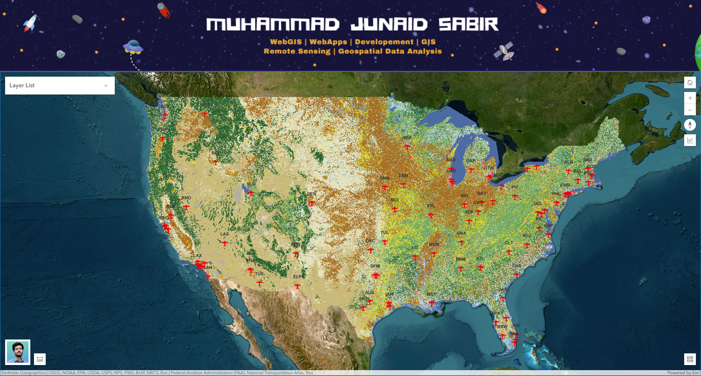
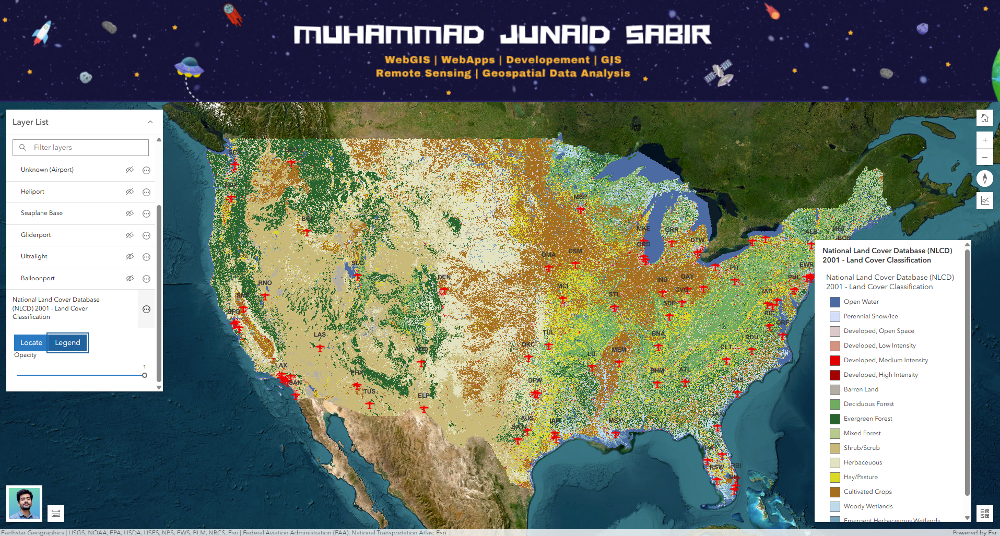
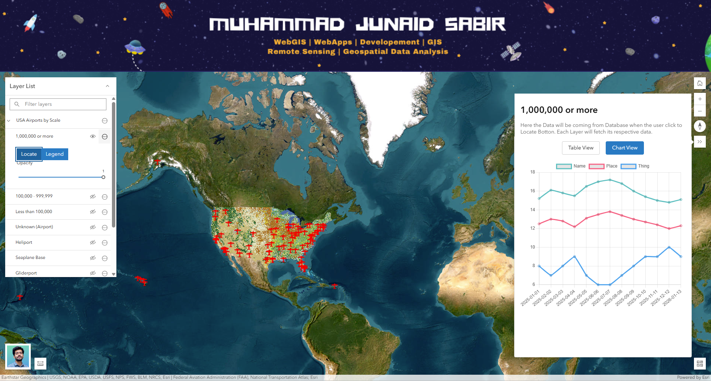

# Web GIS Application

PROJECT: "Demonstration of the Capabilities of ArcGIS API: ArcGIS Maps SDK for JavaScript 4.33"

This is a GIS Web app that consists of twp distinct GIS Layers. 

First, image service contains the National Land Cover Database (NLCD) 2001 land cover classification rasters of the conterminous U.S.. The NLCD 2001 land cover dataset was produced through a cooperative project conducted by the Multi-Resolution Land Characteristics (MRLC) Consortium. The MRLC Consortium is a partnership of federal agencies, consisting of the U.S. Geological Survey (USGS), the National Oceanic and Atmospheric Administration (NOAA), the U.S. Environmental Protection Agency (EPA), the U.S. Department of Agriculture (USDA), the U.S. Forest Service (USFS), the National Park Service (NPS), the U.S. Fish and Wildlife Service (FWS), the Bureau of Land Management (BLM) and the USDA Natural Resources Conservation Service (NRCS). To get more details about the NLCD program and downloadable data, please visit http://www.mrlc.gov. This data is managed using a mosaic dataset. Esri reserves the right to change or remove this service at any time and without notice.

Second, The dataset provides users with information about airport locations and attributes and can be used for national and regional analysis applications. The Airports database is a geographic point database of aircraft landing facilities in the United States and U.S. Territories. Attribute data is provided on the physical and operational characteristics of the landing facility, current usage including enplanements and aircraft operations, congestion levels and usage categories. This geospatial data is derived from the FAA's National Airspace System Resource Aeronautical Data Product.

This WebGIS allows users to visualize and interact with spatial and SQL data. It is designed to showcase Advance WebGIS functionalities of ArcGIS API in a user-friendly interface.

## Live Demo

[Link to show this App Demo](https://m-junad-sabir.github.io/Advanced-Custumized-LayerListPanel/)

## Features

*   **Interactive Map:** Users can pan, zoom, and interact with the map.
*   **Home Mapview:** User can go back to the default Mapview of the webapp using Home Button.

### Initial Map View

*   **Layer Controls:** Highly Custumized Layerlist Panel containing Change Opacity, Zoom to Layer, and Toggle Legends On and Off functions.

### Legends Toggle

*   **Data Fetching:** Fetch and display any type of stored or live data from your database.
*   **Expandable Results:** View fetched data in an expandable and well-organized result panel.

### Fetched SQL Data

## Key Features

*   **Interactive Map:** Built with the ArcGIS API for JavaScript, allowing for smooth panning, zooming, and exploration of spatial data.
*   **Dynamic Layer Control:** A layer list widget allows users to toggle the visibility of different map layers and groups of layers.
*   **Data-driven Popups:** Clicking on map features opens informative pop-ups with details about the selected feature.
*   **Informative Legends:** A legend widget helps users understand the symbols used on the map.
*   **Basemap Switching:** Users can switch between different basemaps (e.g., satellite, street) to suit their needs.
*   **Data Visualization:** Fetched data can be viewed in both a paginated table and an interactive line chart.
*   **Responsive Design:** The application is designed to work on different screen sizes, from desktops to mobile devices.

## Built With

*   [ArcGIS API for JavaScript](https://developers.arcgis.com/javascript/latest/) - For creating interactive maps and GIS functionality.
*   HTML
*   CSS
*   JavaScript

The Real Application is developed in .NET 8 / ASP.NET Framwork with C# Language to GET Data from SQL Server Database for the Client.

## Setup and Installation

1.  Clone the repository
2.  Add your Own Published GIS Layers from ArcGIS Server
3.  Change Header Image and LogoDiv Image
4.  Build your Backend Code and connect the Database to GET data in the Result Panel
5.  Your backend code will establish bridge between your frontend UI and Database. It triggers function call to fetch data in the Result Panel
6.  Open `index` file in your web browser

## License

This project is licensed under the [MIT License](./LICENSE).
